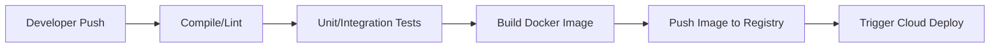

# DevOps & Cloud Deployment Reference Guide

This reference sheet summarizes the core concepts of Docker, Kubernetes, Terraform, and CI/CD pipelines needed for cloud deployment interviews.

---

## 🐋 1. Docker & Containerization

*   **Docker Container**: An isolated user-space execution environment containing code, runtime, system tools, libraries, and settings.
*   **Docker Image**: A read-only template with instructions for creating a Docker container. Built in layers.
*   **Multi-Stage Builds**:
    *   *Concept*: Using multiple `FROM` instructions in a single Dockerfile.
    *   *Purpose*: Dramatically reduces final image size by copying only the compiled production assets (e.g. build binaries) from a heavy build stage to a clean, lightweight runtime stage (like `nginx:alpine` or `distroless`).
*   **Caching Layers**: Each command in a Dockerfile (like `RUN`, `COPY`) creates a layer. Order commands from least-frequently changed to most-frequently changed to maximize Docker build caching.

---

## ☸ 2. Kubernetes Orchestration

*   **Pod**: The smallest deployable unit in Kubernetes. Represents a single running process and can contain one or more tightly coupled containers.
*   **Deployment**: Declares the desired state of Pods (e.g., run 3 replicas). Automatically manages rolling updates, updates container versions, and handles node failures.
*   **Services**: Abstraction exposing pods over the network.
    *   *ClusterIP*: Default. Exposes the Service on a cluster-internal IP (only reachable within the cluster).
    *   *NodePort*: Exposes the Service on each Node's IP at a static port (typically `30000-32767`).
    *   *LoadBalancer*: Exposes the Service externally using a cloud provider's load balancer.
*   **Ingress**: API object managing external access to services, typically HTTP/S. Handles SSL termination, name-based virtual hosting, and path-based routing.
*   **Horizontal Pod Autoscaler (HPA)**: Automatically scales the number of Pods in a replication controller or deployment based on observed CPU utilization or memory metrics.

---

## ⚙ 3. Infrastructure as Code (IaC) — Terraform

*   **Declarative vs Imperative**:
    *   *Declarative*: You define the desired end state (Terraform). The tool determines how to reach it.
    *   *Imperative*: You define the exact step-by-step commands (Bash scripts, Ansible) to reach the state.
*   **State Management (`.tfstate`)**:
    *   Tracks metadata mapping resources in code to actual cloud resources.
    *   *Remote State Backend*: Stores the state file in a shared cloud bucket (e.g. AWS S3) with state locking (e.g. via AWS DynamoDB) to prevent concurrent changes and lock collisions.

---

## 🚦 4. CI/CD Automated Pipelines

A healthy pipeline automates developer validation loops:

*   **Continuous Integration (CI)**: Automates building, linting, and testing code whenever a developer pushes to the main branch.
*   **Continuous Deployment (CD)**: Automatically deploys the tested container images to staging or production environments upon pipeline completion.
